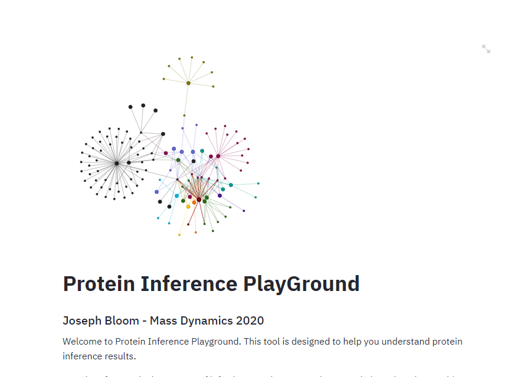

# Protein Inference - Mass Dynamics (MD)

This codebase is being developed at Mass Dynamics https://www.massdynamics.com/ to facilitate work on the [Protein Inference Problem](https://bmcbioinformatics.biomedcentral.com/articles/10.1186/1471-2105-13-S16-S4). 

It has been developed using  the output of [crux comet/percolator](https://crux.ms/commands/percolator.html) (eg: percolator.target.psms.txt), but requires only that psm tables contain q-value and score columns, although more information about psms could theoretically be integrated into scoring methods. 

This codebase could be used for the following purposes:

    * to develop or benchmark protein inference algorithms using shared data processing and  parallelization infrastructure
    * to visualize the peptide-protein networks that are being reasoned about by a protein inference algorithm
    * to opensource an algorithm that is implimented inside this package

The REPRISAL algorithm, currently unpublished, was the first novel algorithm implemented inside the protein_inference framework and is contained in the distinct subpackage "reprisal". 

REPRISAL stands for "REcursive PRotein Inference Scoring ALgorithm" and works by iteratively scoring proteins by their associated peptides and grouping all associated and unallocated peptides with the highest scoring protein at each iteration. FDR's are then calculated as per the score distributions for proteins in the target and decoy tables. 

Protein inference and related algorithms can appear quite complicated at first but once the following concepts are understood, turn out quite simple. 

## Installation 

```
python setup.py install
```

## Development Set up

conda create --name protein_inference
conda activate protein_inference
conda install --file requirements.txt

## Dependencies

Many of these are just used in the benchmarking suite for visualization. 

[pandas](https://github.com/pandas-dev/pandas)
[networkx](https://networkx.org/)
[pyvis](https://pyvis.readthedocs.io/en/latest/index.html)
[matplotlib](https://matplotlib.org/)
[plotly](https://plotly.com/python/)
[seaborn](https://seaborn.pydata.org/)
[upsetplot](https://pypi.org/project/UpSetPlot/)

## Quick Start

If you have a psms list from percolator (or otherwise) ready to go, you can run the default pipeline easily:

```python
import protein_inference as pi

target_path = "path/to/your/target.psms.txt"
decoy_path =  "path/to/your/decoy.psms.txt"
output_directory = "path/to/your/output_directory"
pi.ProteinInferenceRunner().run(target_path, 
                            decoy_path,
                            output_directory)

```

You can also run the package via the commandline if you can specify the path to the python directory where you have protein_inference installed. 

```bash
python -m <virtualenv_name>/lib/<python_ver>/site-packages/protein_inference.main \
  --output-directory path/to/out/folder \
  --target-path path/to/your/target.psms.txt \
  --decoy-path path/to/your/decoy.psms.txt

```

## Streamlit App

If you'd like to play around with some processed data/visualization, install streamlit and run the protein inference playground app.

```bash
pip install streamlit
cd streamlit
streamlit run pi_playground
```

You should see this at the top of the page.



## Future Plans: 

The benchmarking suite is currently undocumented as it is still being developed. I'll get around to this as I work towards publishing REPRISAL as a paper. 

While not currently in development, possible additions to this codebase are:
  - Writing file converters to accept mzIdentML
  - Integrating Baysian methods such as Fido or EPIFANY.
  - Integrating an optimisation method, maybe using a package like PULP. 
  - Further development of benchmarking suite to allow easy comparison of existing algorithms. 
